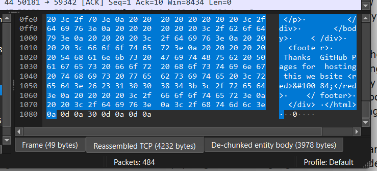

# Dan's Website - Developer Documentation

## Todo

- The blog entry text is aligned due to padding at 20% on each side. When presented on any screen though it will always add this 20% which is not ideal for smaller screens (ViewPorts?). Adjust it so it doesn't add this padding under a certain screen size.
  - Added a media query in the HTML to find out the width of the view port.
- ~~The footer will start overlapping with the main blog content when minimizing the browser window. How do we make it scrollable, so it doesn't overlap?~~
  - Just removed the position: fixed in the .footer class
- ~~The footer seems to not position itself correctly. When the content is short for the ViewPort, the footer displays directly after the main content. Change the footer so it displays at the bottom of the page when displayed in a large vertical ViewPort.~~
  - Moved the footer out of the body, used a flexbox wrapper around a body div and a footer div. Set the height to the flex box just enough to not cause a scroll bar to appear on my screen
  - Also, removed top margin and adjusted the flexbox view height of the body, since that still had a margin of 8.
- Make a real calculator
- Wireshark shows some trailing newlines and things. FIgure out why and if we should and can remove it:

## Notes

- Shift + Alt + f will format HTML code. Used Prettier VS Code extension to improve this.
- Margin will collapse where padding won't. Meaning a right margin of 1em next to an element with a left margin of 1em will only have 1em of space between them. If, instead, padding was used, there would be 2em of space between the content.
